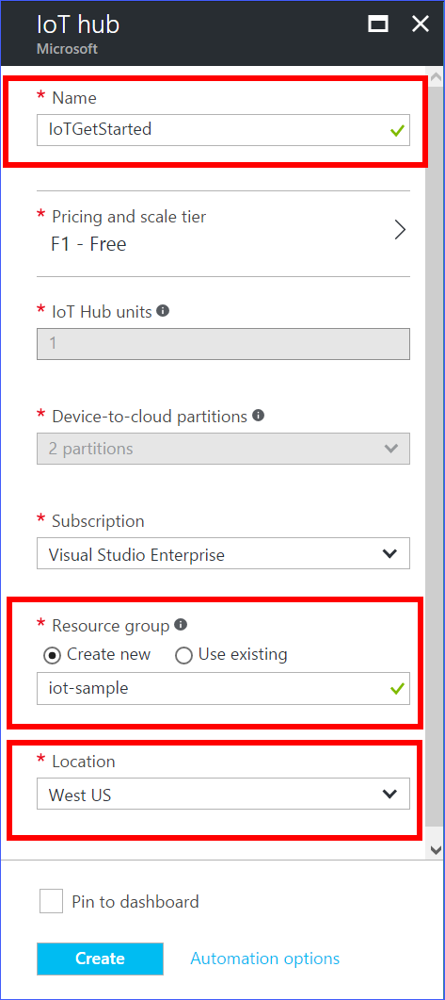
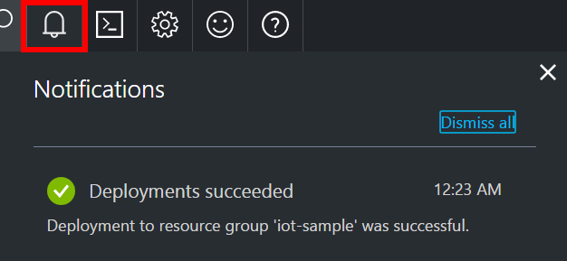

# Connect Electric Imp to Azure IoT Hub

In this tutorial, you begin by learning the basics of working with Electric Imp. We will use Electric Imp Libraries to seamlessly connect an [impExplorer&trade; Kit](https://store.electricimp.com/collections/featured-products/products/impexplorer-developer-kit?variant=31118866130) or an [impAccelerator™ Fieldbus Gateway](https://store.electricimp.com/products/impaccelerator-fieldbus-gateway?variant=31118564754) with a MikroBUS Thermocouple to the cloud by using [Azure IoT Hub](https://docs.microsoft.com/en-us/azure/iot-hub/iot-hub-what-is-iot-hub). This tutorial implements manual device registration through the IoT Hub UI. For automatic device registration, please see this [tutorial](./AutoRegister_StepByStep_Instructions.md).

## What You Do

* Configure your impExplorer Kit with BlinkUp&trade;.
* Create an IoT Hub.
* Register your impExplorer in IoT Hub.
* Run a sample application using the Electric Imp IDE to send sensor data to IoT Hub.

## What You Learn

* How to configure your imp-enabled device with BlinkUp.
* How to use the Electric Imp IDE.
* How to create an Azure IoT Hub.
* How to register your device with your IoT Hub and get your connection string.
* How to collect temperature data from a sensor.
* How to send sensor data to your IoT Hub.

## What You Need

1. Your 2.4GHz 802.11bgn WiFi network *name* (SSID) and *password*.
2. A computer with a web browser.
3. A smartphone with the Electric Imp app ([iOS](https://itunes.apple.com/us/app/electric-imp/id547133856) or [Android](https://play.google.com/store/apps/details?id=com.electricimp.electricimp)).
4. A free [Electric Imp Account](https://impcentral.electricimp.com/login).
5. A [Microsoft Azure Account](https://azure.microsoft.com/en-us/resources/videos/sign-up-for-microsoft-azure/).
6. Electric Imp supported hardware with a temperature sensor. We have complete step by step instructions for the harware listed below.
    - An [Electric Imp impExplorer Kit](https://store.electricimp.com/collections/featured-products/products/impexplorer-developer-kit?variant=31118866130)
        - The impExplorer Kit has an onbard Temperature sensor, so no extra hardware is required.
    - [impAccelerator™ Fieldbus Gateway](https://store.electricimp.com/products/impaccelerator-fieldbus-gateway?variant=31118564754)
        - [MikroBUS board](https://shop.mikroe.com/thermo-click)
        - [Thermocouple](https://shop.mikroe.com/thermocouple-type-k-glass-braid-insulated)
7. USB power source or if you are using the impExplorer Kit you may use three AA batteries.

## Set Up Your Electric Imp Device With BlinkUp

Follow the hardware setup instructions for your Electric Imp hardware, then follow the BlinkUp instructions.

### impExplorer Kit

The impExplorer Kit provides a set of sensors and peripherals which are ready to use. This project will take readings from the onboard temperature/humidity sensor and send the readings to IoT Hub. We only need to assemble the impExplorer Kit. The Kit comes with the following components:

1. An imp001 card, which has a 2.4GHz 802.11bgn WiFi radio for connectivity, and a microcontroller that drives all the logic for the board.
2. The impExplorer Kit into which the card is plugged.
3. A USB cable to power the impExplorer Kit.

#### Hardware Setup

- Plug the imp001 card into the breakout board slot.
- Power up your Imp with the USB cable or three AA batteries.
- The imp001 should now have power and be blinking amber.
- Move on to [Electric Imp BlinkUp](#electric-imp-blinkup) section

Assembled, the Kit it should look like this:

### impAccelerator™ Fieldbus Gateway

The Fieldbus gateway doesn't come with any onboard sensors, so you will need to have a MikroBUS click and Thermocouple.

- Take the Fielbus Gateway board out of the enclosure.
- Plug the THERMO click into the MikroBUS headers.
- Plug the Thermocouple into the THERMO click board
- Power up your Fielbus Gateway with the USB cable
- Move on to [Electric Imp BlinkUp](#electric-imp-blinkup) section

Assembled, the Kit it should look like this:

### Electric Imp BlinkUp

Open the Electric Imp mobile app on your smartphone to configure your device.

1. Log into your Electric Imp account.
2. Click on **Configure a Device**
3. Select **Wireless**
4. Enter your 2.4GHz 802.11bgn WiFi credentials, then click **Next**
5. Follow the instructions in the app to configure your device for local network access.
6. See instructions on our dev center for detailed BlinkUp instructions for your hardware
    - [impExplorer Kit](https://electricimp.com/docs/gettingstarted/explorer/quickstartguide/)
    - [impAccelerator™ Fieldbus Gateway](https://electricimp.com/docs/hardware/fieldbusgateway/blinkup/)

### How Electric Imp’s IoT Connectivity Platform Works

The Electric Imp Platform has two main components: the imp-enabled device and the impCloud&trade;. The imp-enabled device runs the device code, which in this use case consolidates the data gathered from the temperature/humidity sensor. Each device is paired one-to-one with its own online assistant &mdash; or, as we call it, an ‘agent’ &mdash; in the impCloud and which runs the agent code. The device sends this data to its agent. In this example, the agent code relays the data to the Azure IoT Hub cloud. Here’s a broad overview of this flow:

The Electric Imp IDE provides all the tools you need to write and deploy the software (to the device and to its agent) that will control your imp-enabled connected product. The IDE runs in a desktop web browser and communicates between the device and cloud solutions.

If you’d like a quick overview of the IDE features please visit the Electric Imp [Dev Center](https://electricimp.com/docs/gettingstarted/explorer/ide/).

### Working With The Electric Imp IDE

1. In your favorite web browser log into [impCentral](https://impcentral.electricimp.com/login).
1. Click **Create a Product**.

1. In the popup, enter a Product name (e.g., **AzureIoTHub**), a Device Group name (e.g., **TempExample**), and then click **Create**. 
 A Product defines a new connected product in the Electric Imp impCloud. A Device Group is the place where you develop and test your application software, both the device code and the agent code.
1. Click **Assign devices**. 

1. In the **Assign Devices** popup, choose your device by locating its device ID, and click **Assign**.

1. At the top of the logs pane you can find the agent URL of your device. It will look something like this: **https://agent.electricimp.com/tgqsQukvcfyb**
1. Make a note of the agent ID &mdash; the last part of the agent URL (ie. "tgqsQukvcfyb" in the above example). We will use this in the next steps as a unique identifier when registering our device in IoT Hub:

1. Leave impCentral open in your browser &mdash; you will be returning to it later.

## Create an IoT Hub resource

1. In the [Azure portal](https://portal.azure.com/), click **New > Internet of Things > IoT Hub**:

2. In the **IoT hub** pane, enter the following information for your IoT hub:

 - **Name** This is the name for your IoT hub. If the name you enter is valid, a green check mark appears.

 - **Pricing and scale tier** Select the free F1 tier. This option is sufficient for this demo. See [pricing and scale tier](https://azure.microsoft.com/pricing/details/iot-hub/).

 - **Resource group** Create a resource group to host the IoT hub or use an existing one. See [Using resource groups to manage your Azure resources](https://docs.microsoft.com/en-us/azure/azure-resource-manager/resource-group-portal).

 - **Location** Select the location closest to where the IoT hub was created.

 - **Pin the dashboard** Check this option for easy access to your IoT hub from the dashboard:

3. Click **Create**. It could take a few minutes for your IoT hub to be created. You can see progress in the **Notifications** pane:

4. Once your IoT hub is created, click it from the dashboard. Click on **Overview**. Make a note of the **Hostname**, and then click **Shared access policies**:

5. In the **Shared access policies** pane, click the **registryReadWrite** policy, and then copy and make a note of the **Connection string--primary key** of your IoT hub. You will need to enter this value in the code later:

## Register A Device In IoT Hub

In this example we will register the device via the Azure portal. Please note that devices can also be registered programmatically by using the Electric Imp AzureIoTHub library’s *AzureIoTHub.Registry* class methods.

1. In the [Azure portal](https://portal.azure.com/), open your IoT hub.

2. Click **Device Explorer**.

3. Click **Add** to add a device to your IoT hub. Enter:

 - **Device ID** The ID of the new device. For this example we will use the Agent ID (see step 5 of the Electric Imp IDE / Code section)
 - **Authentication Type** Select **Symmetric Key**.
 - **Auto Generate Keys** Check this field.
 - **Connect device to IoT Hub** Click **Enable**.

 

4. Click **Save**.

5. After the device is created, open the device in the **Device Explorer** pane.

6. Make a note of the **Connection string--primary key**. We will use this when running our sample application:

## Run A Sample Electric Imp Application

1. Reopen [impCentral](https://impcentral.electricimp.com).
1. Copy and Paste the [agent code](./IoTHubEnvExample_ManualRegister.agent.nut) from GitHub into the IDE’s agent pane (the left-hand side).
1. The device code is specific to your hardware. Copy and Paste the device code for your hardware from GitHub into the IDE’s device pane (the right-hand side).
    - [impExplorer Kit device code](./IoTHubEnvExample_ExplorerKit.device.nut)
    - [impAccelerator™ Fieldbus Gateway](./IoTHubEnvExample_FieldbusGateway.device.nut)

1. In the agent code look for the **IOTHUB_CONNECTION_STRING** and **DEVICE_CONNECTION_STRING** variables. Copy and paste your connection string from **Create an IoT Hub resource** step 5 in to the **IOTHUB_CONNECTION_STRING** variable. Copy and paste your device connection string from **Register a device in IoT hub** step 6 in to the **DEVICE_CONNECTION_STRING** variable.

1. Hit **Build and Force Restart** to save and launch the code.

1. As the application runs you will begin to see logs from your device:

## Next Steps

You’ve run a sample application to collect sensor data and send it to your IoT hub.

To continue getting started with IoT Hub and to explore other IoT scenarios, see:

- [Manage cloud device messaging with iothub-explorer](https://docs.microsoft.com/en-us/azure/iot-hub/iot-hub-explorer-cloud-device-messaging)
- [Save IoT Hub messages to Azure data storage](https://docs.microsoft.com/en-us/azure/iot-hub/iot-hub-store-data-in-azure-table-storage)
- [Use Power BI to visualize real-time sensor data from Azure IoT Hub](https://docs.microsoft.com/en-us/azure/iot-hub/iot-hub-live-data-visualization-in-power-bi)
- [Use Azure Web Apps to visualize real-time sensor data from Azure IoT Hub](https://docs.microsoft.com/en-us/azure/iot-hub/iot-hub-live-data-visualization-in-web-apps)
- [Weather forecast using the sensor data from your IoT hub in Azure Machine Learning](https://docs.microsoft.com/en-us/azure/iot-hub/iot-hub-weather-forecast-machine-learning)
- [Device management with iothub-explorer](https://docs.microsoft.com/en-us/azure/iot-hub/iot-hub-device-management-iothub-explorer)
- [Remote monitoring and notifications with Logic Apps](https://docs.microsoft.com/en-us/azure/iot-hub/iot-hub-monitoring-notifications-with-azure-logic-apps)
